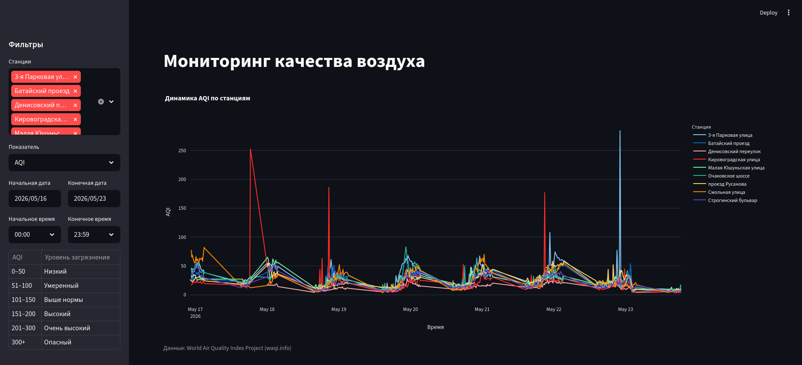
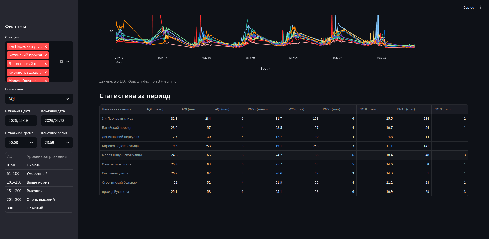

# Air quality monitoring

## What this project is about

This project allows for the graphic visualization of air quality data for select stations and/or locations.

## Stack

- Python
- Streamlit
- PostgreSQL
- pandas
- Plotly

## Screenshots




## How to run this project locally

First you need to get your personal token to access air quality data. You can do that at https://aqicn.org/api/ If the site is inaccessible from your location, you will need to use a proxy server.

1. Clone this repository.
2. Replace the TOKEN keyword in script.py with your personal token.
3. If you use a proxy server, replace the PROXY keyword in script.py with your proxy address.
4. Open your PostgreSQL database and replace the following keywords in script.py and dashboard.py with the information of your connection:
    - CONN_DBNAME: name of your connection database
    - CONN_USER: your username
    - CONN_PASSWORD: your password
    - CONN_HOST: your host address
    Your connection will collect data only if it is active.
5. Run a PostgreSQL script to create an empty table where all collected data will be written. See PostgreSQL setup for more.
6. By default you will start collecting data for 9 stations in Moscow. You can change this in config.py.
7. Access the project folder via terminal and run the following commands:

    `python3 -m venv venv`
   
    `source venv/bin/activate`
   
    `pip install -r requirements.txt`
   
9. To collect data used for the final graph, set script.py to run automatically.
    An example using cron for automatic updates every 15 minutes:
   
    `*/15 * * * * [project folder]/venv/bin/python3 [project folder]/script.py`
   
11. Once you have enough data, run the following command to see the graph:
    
    `streamlit run dashboard.py`
    
    A new tab with the graph and the table should automatically open in your default browser.


## Project structure

- **script.py**: fetches data from WAQI, parses it and sends it to the PostgreSQL database
- **dashboard.py**: visualizes the data from the PostgreSQL database in the form of a graph and a table which lists mean, minimum and maximum values for each datapoint (AQI, PM2.5, PM10) for each station
- **config.py**: keeps station names


## PostgreSQL setup
Run the following command to create the default table in PostgreSQL:

```sql
CREATE TABLE air_quality
 (id bigint NOT NULL,
  station_name varchar NOT NULL,
  timestamp timestamptz NOT NULL,
  aqi bigint,
  pm25 int,
  pm10 int,
  PRIMARY KEY (id, timestamp));
  ```
