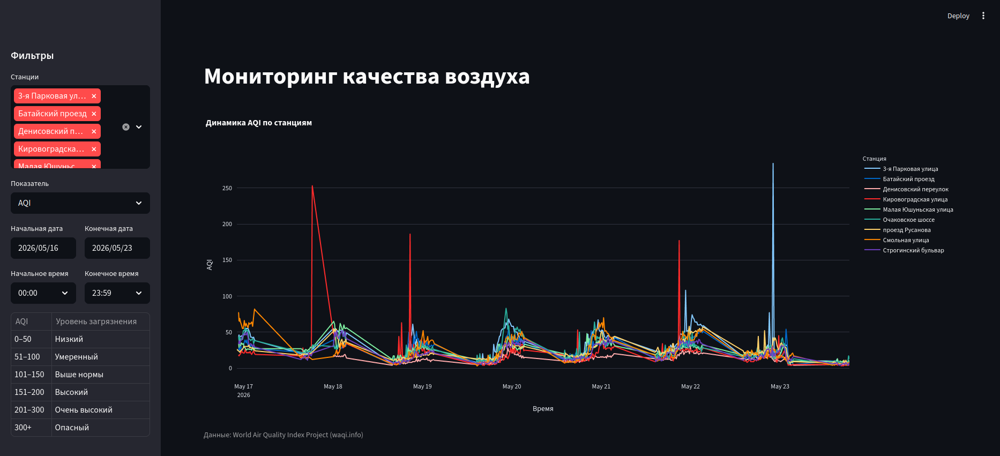
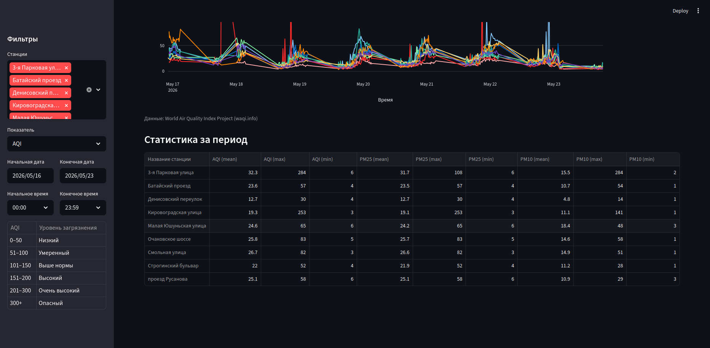

# Air quality monitoring

## What this project is about

This project allows for the graphic visualization of air quality data for select stations and/or locations.

## Stack

- Python
- Streamlit
- PostgreSQL
- pandas
- Plotly
- Docker

## Screenshots

## How to run this project locally

First you need to get your personal token to access air quality data. You can do that at https://aqicn.org/api/ If the site is inaccessible from your location, you will need to use a proxy server.

1. Clone this repository.
2. Create the .env file in the main folder. See .env setup for more.
3. Access the project folder via terminal and run the following command:
    `docker compose up --build -d`

Your dashboard will be available at http://localhost:8501. The first data will appear in 15 minutes.
By default you will be collecting data for 9 stations in Moscow. You can change this in config.py.

## Project structure

- **script.py**: fetches data from WAQI, parses it and sends it to the PostgreSQL database
- **dashboard.py**: visualizes the data from the PostgreSQL database in the form of a graph and a table which lists mean, minimum and maximum values for each datapoint (AQI, PM2.5, PM10) for each station
- **config.py**: keeps station names
- **Dockerfile.script**: creates an image for collecting data using cron
- **Dockerfile.dashboard**: puts the image together for the web dashboard
- **docker-compose.yml**: orchestrates 3 containers (script, dashboard, db)
- **init.sql**: creates a table after the initial launch of the database

## .env setup

TOKEN=*your_token*
PROXY=*your_proxy*  # optional
CONN_DBNAME=air_quality
CONN_USER=postgres
CONN_PASSWORD=*your_password*
CONN_HOST=db

## Tests launch

`python3 -m pytest test_script.py -v`